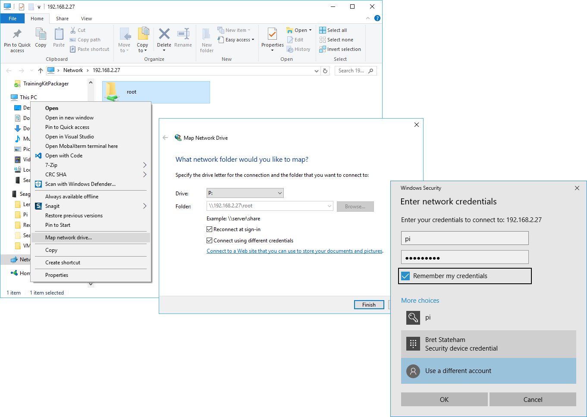
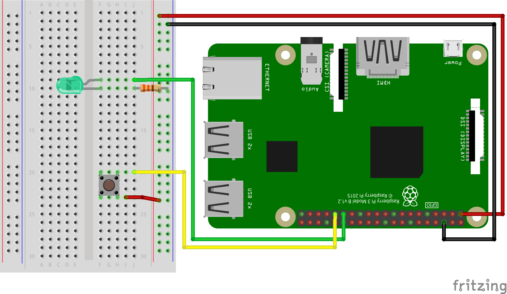

# pinodevscode

Debugging Node.js on the Raspberry Pi with Visual Studio Code

## Overview

This walkthrough will show you how you can easily debug Node.js applications on the Raspberry Pi using Visual Studio Code on Windows (and when I get around to documenting it, for the Mac as well).

## Steps

1. Flash Raspbian to your SD Card
1. Boot and Configure Pi
    - Give your pi a hostname
    - Enable ssh
    - Setup ssh keys
    - Install and configure Samba
    - Map network drive
    - Create project folder on Pi
      - mkdir foldername
      - touch app.js
      - npm init (accept defaults)
    - Configure git
      - `git config core.fileMode false` on both pi and windows side

## Flash Raspbian to your SD Card

1. Download the latest raspbian image (with desktop) from raspberrypi.org: https://www.raspberrypi.org/downloads/raspbian/

1. Download and install Etcher.io: https://etcher.io/

1. Insert a Micro SD card into it's reader and plug the reader into your computer. Ensure the drive is recognized. 

1. Use Etcher.io to flash the downloaded Raspbian image .zip file on the SD card.

## Boot and Configure Pi

### Boot the pi

1. Connect Monitor, Keyboard and Mouse to the Pi (optional).

1. Plug the SD card into the Pi.

1. Plug the Pi into power to turn it on.

### Configure the Pi's settings

1. When the desktop boots, click "Pi" | "Preferences" | "Raspberry Pi Configuration"

   - Give the pi a hostname
   - Enable the SSH and VNC interfaces.
   - Configure any other options, like resolution, locale, etc., as desired.
   - Click OK, and reboot if necessary

### Setup SSH for easy login with keys   

1. Setup your ssh key to login easily to the pi without having to include a password: https://www.raspberrypi.org/documentation/remote-access/ssh/passwordless.md

   - Open bash on Windows, and run the following accepting all the defaults (including the empty passkey)

        ```bash
        ssh-keygen -t rsa -C "SSH Key for logging into the pi"
        ```
   - ssh into the pi with the password, and create the .ssh folder for the pi profile:

      ```bash
      #RUN THESE COMMANDS ON THE PI
      cd ~
      install -d -m 700 ~/.ssh
      ```

   - Back on your computer, copy they key you created earlier like this, typing in the password one last time:

      ```bash
      # RUN THIS COMMAND IN BASH ON YOUR WINDOWNS LAPTOP
      cat ~/.ssh/id_rsa.pub | ssh pi@your.pi.ip.address 'cat >> .ssh/authorized_keys'
      ```

1. Finally, test out they key by ssh'ing into your pi, and verify you no longer need to enter a password.

### Install and Configure Samba

1. ssh into the pi, and run the following:

    ```bash
    sudo apt-get update
    sudo apt-get upgrade
    sudo apt-get install -y samba samba-common-bin
    ```

1. In the ssh prompt on the pi, rename the default `/etc/samba/smb.conf` to `smb.conf.old`, and create a new `/etc/samba/smb.conf` file using nano:

    ```bash
    sudo mv /etc/samba/smb.conf /etc/samba/smb.conf.old
    sudo nano /etc/samba/smb.conf
    ```

1. Replace it's contents with the following.

    > **Note**: This is **NOT** a secure configuration, for this walkthrough it is assumed that the raspberry pi is being used in a development environment, and so they root of the Pi's SD card file system is being shared for convenience.  You should read more about how to configure and secure samba at [https://www.samba.org/](https://www.samba.org/) if you will be deploying the pi into a public environment.

    > **Note**: You should be able to copy the contents below, then right click into the nano interface in the ssh prompt to paste it in.  The press **Ctrl-X**, **Y**, **Enter** to save the changes to the `/etc/samba/smb.conf` file.

    ```text
    [global]
    workgroup = WORKGROUP
    dns proxy = no
    log file = /var/log/samba/log.%m
    max log size = 1000
    syslog = 0
    panic action = /usr/share/samba/panic-action %d
    server role = standalone server
    passdb backend = tdbsam
    obey pam restrictions = yes
    unix password sync = yes
    passwd program = /usr/bin/passwd %u
    passwd chat = *Enter\snew\s*\spassword:* %n\n *Retype\snew\s*\spassword:* %n\n *password\supdated\ssuccessfully* .
    pam password change = yes
    map to guest = bad user
    usershare allow guests = yes

    [root]
    comment = root
    path=/
    browseable=YES
    writeable=YES
    valid users= pi, root
    only guest=no
    create mask=0777
    directory mask=07777
    public=no
    force user = root
    ```

1. Finally, set the password for the "pi" user on samba using the following command on the pi, the type, and confirm the password you wish to enter when connecting to the samba shares on the Pi as the "pi" user:

    ```bash
    sudo smbpasswd -a pi
    ```
1. Back on your windows laptop, open a command prompt or powerhell prompt **NOT AS ADMINISTRATOR**, and issue the following command, and when prompted, enter the password for the pi user that you provided with the `smbpasswd` command previously:

    > **Note**: You can alternatively open the pi's UNC path in the Windows Explorer, then right click on the "root" share, and select the "Map Network Drive..." option.  Make sure to Pick the drive letter you want to use (I like "P:" for "Pi"), turn on the  the "Reconnect at sign-in" and "Connect using different credentials" check boxes, then when prompted choose the "Use different credentials" option to login as the pi user with the password you specified above. 

    

    ```cmd
    net use P: \\your.pi.ip.address\root /user:pi /persistent:yes
    ```
## Configure the Pi Circuit

This is just a simple circuit with a momentary push button, and LED, and a 330Ω resistor. 

1. Wire the compoenents as follows:

    - Connect the 3.3v and GND pins on the Pi to their corresponding busses on bread boar power rail.
    - Connect the cathode of the LED via the 330Ω resistor to ground.
    - Connect the anode of the LED to GPIO5 (Pin 29 on the Pi GPIO header)
    - Connect one leg of the momentary push button to the 3.3V bus on the bread board. 
    - Connect the other leg of the momentary push button to GPIO6 (Pin 31 on the Pi GPIO header)

   

### Update git on the pi, and configure it

1. ssh into your pi and run

    ```bash
    sudo apt-get install -y git
    ```

### Install the latest version of Node.js on the pi

1. Install latest node.js 8.x version on the Pi

    ```bash
    curl -sL https://deb.nodesource.com/setup_8.x | sudo -E bash -
    sudo apt-get install -y nodejs
    ```


### Initialize the Node.js app on the pi.

1. ssh into your pi, and run the following commands:

    ```bash
    # Create and change into the folder for the app
    cd ~
    mkdir pinodevscode
    cd pinodevscode
    
    # Create the intial app.js and .gitignore files
    touch app.js
    echo node_modules > .gitignore

    # Initialize the git repo, cause you should just have one
    git init

    #initialize the node by creating the package.json, accepting all defaults
    npm init -y

    # Install the pigpio package needed by the app
    npm install pigpio
    ```

1. Back on your windows computer, open the drive letter you mapped previously in explorer, and navigate to the /home/pi/pinodevscode folder.  Then right-click and select "Open with Code"

1. In code, open the "app.js" file, and replace it's contents with the following code, and save the file:

    ```js
    //Require the pigpio package, this is from https://github.com/fivdi/pigpio
    //This is a Node.js wrapper around the native pigpio C library https://github.com/joan2937/pigpio
    let Gpio = require('pigpio').Gpio;

    //Initialize the LED pin for output (GPIO5, GPIO Header Pin 29) 
    let led = new Gpio(5,{mode: Gpio.OUTPUT});

    //and drive it low (off) initially...
    led.digitalWrite(0);

    //Initialize the Button pin for input (GPIO6, GPIO Header Pin 31) 
    //Use the internal pull down resistor, and have it trigger interrupts
    //on both the rising (button pushed) and falling (button released) edges.
    let button = new Gpio(6,{
    mode: Gpio.INPUT,
    pullUpDown: Gpio.PUD_DOWN,
    edge: Gpio.EITHER_EDGE
    });

    //Setup a flag to indicate if the button is currently being debounced.
    let debouncing = false;

    //We'll stop the app after a certain number of button presses.
    let presses = 0;
    let maxpresses = 10;

    //When the button interrupt is triggered
    //(that could be either when it is turned on or off)
    //take in the level of the button (1 or 0)
    button.on('interrupt',function(level){

        if(debouncing){
            //console.log('Ignoring change. Previous change is debouncing');
            return;
        }

        //Turn on the debouncing flag.
        debouncing = true;

        //debounce by waiting for a number of milliseconds then testing to see if the value is still the same...
        setTimeout(() => {
            if(button.digitalRead()==level){
            //And set the LED to match the level
            led.digitalWrite(level);

            //If the level is 0, the button was 
            //just released, completing a button press
            if(level==0){
                    presses++

                    //Report the level to the console
                    console.log(`${level} - ${presses} of ${maxpresses}`);

                    if(presses >= maxpresses){
                    process.exit(0);
                    }
                }
            }

            //Turn off the debouncing flag
            debouncing = false;
        },25);

    });
    ```
### Run the app directly on the pi:

1. SSH Into the ip, and navigate to the /home/pi/pinodevscode folder

1. Run the app on the pi:

    > **Note**: You always need to run the Node app as sudo because GPIO access on the pi requires root access.

    ```bash
    sudo node app.js
    ```

1. Press the momentary push button on the bread board repeatedly,monitor the output in the ssh session, and verify that the LED is turning on and off with the button.  Press Ctrl-C in the ssh session when you are done testing to stop the app.

### Attach VS Code's debugger to the app on the pi:

1. In the pi's ssh session, ensure you are in the `~/pinodevscode` folder, and run the following command to setup a debug listener on port 9229.  Replace the `your.pi.ip.address` place holder with your pi's actuall ip address:

    ```bash
    # Run the following in the ~/pinodevscode folder on the pi

    sudo node --inspect-brk=your.pi.ip.address:9229 app.js
    ```

    For example, if your Pi's IP address were **192.168.2.27**, you would run:

    ```bash
    sudo node --inspect-brk=192.168.2.27:9229 app.js
    ```

1. Back in VS Code on your computer, click the "Debug" button, and click the "gear" icon along to the top, and select Node.js to create a node.js debug config.

1. Click the "Add Configuration..." button at the bottom to create a new debug config, and scroll through the list to select "**Node.js: Attach to Remote Program**", and modify the new config as follows:

    - Change the "address" value to match the IP address of your Pi.
    - Change the "port" to 9229,
    - Leave the "localRoot" as "${workspaceRoot}"
    - Change the "remoteRoot" to "/home/pi/pinodevscode"
    - DELETE the entire default "Launch Program" configuration

    For example, with a pi ip address of 192.168.2.27, your launch.json should look like this:

    ```JSON
    {
        "version": "0.2.0",
        "configurations": [
            {
            "type": "node",
            "request": "attach",
            "name": "Attach to Remote",
            "address": "192.168.2.27",
            "port": 9229,
            "localRoot": "${workspaceRoot}",
            "remoteRoot": "/home/pi/pinodevscode"
            }
        ]
    }
    ```

1. In the VS Code debug panel, click the green triangle button at the top to start the remote debug session.  Note that the app.js file is opened, and the first line of code is highlighted, and indicating that is the next line of code to be run (that's because we used --inspect-brk.  If we just used --inspect, the app would have run and waited until a breakpoint or an error occurred.)

1. In the app.js file, scroll to line 52, and click in the "gutter" (the white space to the left of the line number) to create a break point. 

1. In the debug tool bar, click the "green triangle" to continue running the app.

1. Press and release the momentary push button connected to the pi, and notice is VS code that the breakpoint on line 52 is hit, and the code stops executing there.

1. Look at the variable values, locals, etc.  To learn more about debugging Node.js in VS Code, check out [Node.js Debugging in VS Code](https://code.visualstudio.com/docs/nodejs/nodejs-debugging)

1. Press F5 (or the green triangle button again) to let the app continue.  Notice the LED light status as well.  You can click on the breakpoint next to line 52 to stop breaking there if you wish. 

1. Continue pressing and releasing the momentary button  a total of 10 times (maxpresses) to stop the app, or press Ctrl-C in the ssh session to stop the debugger.

### Create a VS Code task to start the debugger remotely.

1. In VS Code, press "Ctrl-Shift-P" to open the "Quick Open" pallette, and type "Tasks: Configure Task Runner", then press "Enter", then select "Others".

1. Replace the entire contents of the file with the following, again replacing the two `your.pi.ip.address` place holders with your pi's ip address:

    ```JSON
    {
        // See https://go.microsoft.com/fwlink/?LinkId=733558
        // for the documentation about the tasks.json format
        "version": "2.0.0",
        "tasks": [
            {
            "taskName": "Start Remote Debugger",
            "type": "shell",
            "command": "ssh -t pi@your.pi.ip.address \"sudo node --inspect-brk=your.pi.ip.address:9229 /home/pi/pinodevscode/app.js\"",
            "problemMatcher":[]
            }
        ]
    }
    ```

    For example, if your pi's address is 192.168.2.27:

    ```JSON
    {
        // See https://go.microsoft.com/fwlink/?LinkId=733558
        // for the documentation about the tasks.json format
        "version": "2.0.0",
        "tasks": [
            {
            "taskName": "Start Remote Debugger",
            "type": "shell",
            "command": "ssh -t pi@192.168.2.27 \"sudo node --inspect-brk=192.168.2.27:9229 /home/pi/pinodevscode/app.js\"",
            "problemMatcher":[]
            }
        ]
    }
    ```
1. Now rather than having to ssh into your pi separately, you can use the "Start Remote Debugger" task to do it for you.  Press Ctrl-P and type task[space] then select the "Start Remote Debugger" task or simply press "S" to select it, then press Enter.

### Setup a keyboard shortcut to allow you to quickly start the session:

1. In VS Code, click the gear icon in the lower left corner, then select "**Keyboard Shortcuts**", then at the top of the "**Keyboard Shortcuts**" tab, click the "**keybindings.json**" link.

1. In the "**keybindings.json**" tab on the right, add the following to the JSON array, and save the file.

    ```JSON
    {
        "key": "ctrl+alt+shift+d",
        "command":"workbench.action.tasks.runTask",
        "args": "Start Remote Debugger"
    }
    ```

    For example, if that was the only keyboard mapping you had, you would have the following for the entire file contents:

    ```JSON
    // Place your key bindings in this file to overwrite the defaults
    [
        {
            "key": "ctrl+alt+shift+d",
            "command":"workbench.action.tasks.runTask",
            "args": "Start Remote Debugger"
        }
    ]
    ```

1. Now you can simply press Ctrl+Alt+Shift+D on your keyboard to start the remote debugger, then F5 to start the VS Code debug session.  Cool! 


